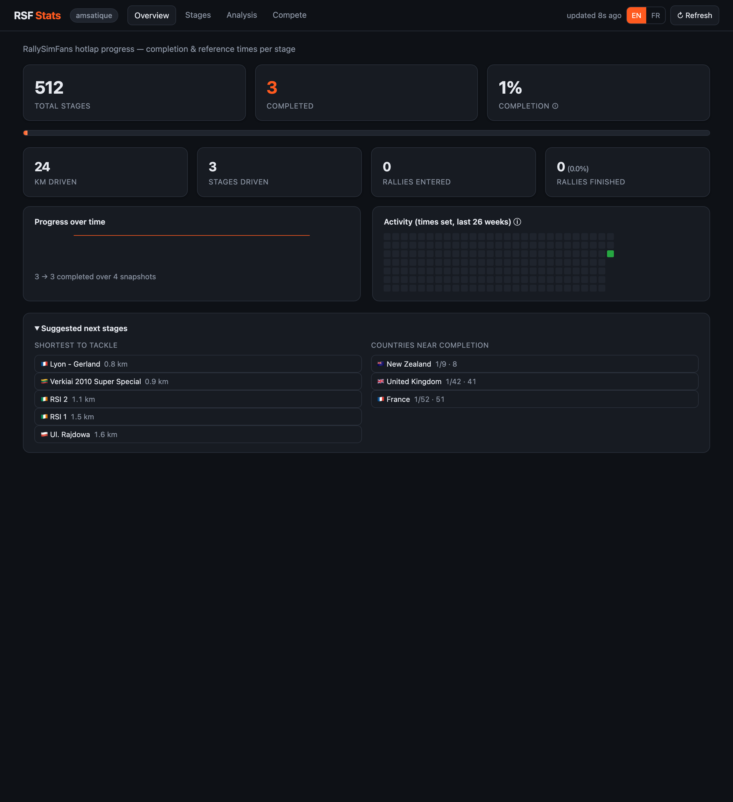
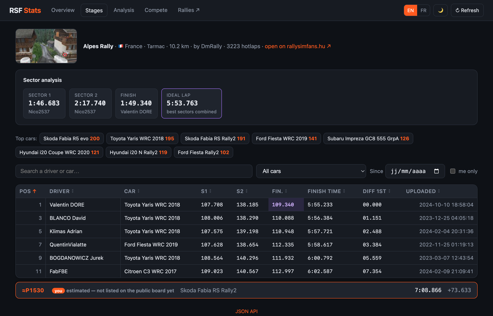

# RSF Stats

A self-hosted web dashboard for your [RallySimFans](https://rallysimfans.hu)
(Richard Burns Rally) stats: for each stage, see whether you've **completed it**,
your **reference time**, where you rank, and how to improve.

Data is scraped from RallySimFans on demand and cached; a small local SQLite file
keeps your completion history, personal bests and followed drivers.



Every stage links to its full leaderboard — all recorded hotlaps, with sector
comparison against the best:



## How it works

Your board comes from a single authenticated page
(`hotlap.php?centerbox=hotlap_drvtimes`), which contains:

- **Hotlap Stages**: the full stage catalog (~512), grouped by country.
- **Hotlap Rank**: your recorded times.

A stage present in your times = **completed** (with its reference time);
otherwise = **not completed**. Per-stage leaderboards, sectors and ranks come from
each stage's hotlap page.

## Features

- **Per-stage board**: completion status, reference time, car, gap to the world
  record (Diff 1st), upload date, surface (gravel / tarmac / snow) and length.
- **My rank & percentile**: for completed stages, my position in the field
  (e.g. `342 / 850 · top 40%`), fetched from each stage leaderboard (throttled,
  capped, cached).
- **Career summary**: rallies entered/finished (finish rate) and total kilometres.
- **Breakdown by surface & country**: completion bars for gravel/tarmac/snow and
  per country, with flags.
- **Suggested next stages**: shortest stages left to tackle, and countries closest
  to completion.
- **Progress over time & personal bests**: an opt-in SQLite history records each
  visit, drawing a completion sparkline and flagging improved times.
- **Stage leaderboard** (`/stage/<id>`): every recorded hotlap, sortable by
  date/time/position, filterable by car/date, with **your row highlighted**, the
  stage photo, its author, and a top-cars breakdown.
- **Sector analysis**: per-sector split times, fastest driver per sector, the
  theoretical **ideal lap** (best sectors combined), and your gap per sector.
- **Time on the table**: for your completed stages, the seconds you'd gain by
  matching the best sector times — ranked by biggest potential.
- **Since your last visit**: new completions, personal bests and rank movements
  detected between visits.
- **Strengths profile**: your average finishing percentile by surface and by
  country — see where you're strong.
- **Activity heatmap**: a GitHub-style calendar of when you set your times.
- **Bilingual UI**: English/French toggle (EN/FR), remembered via a cookie, with
  inline tooltips (ⓘ) explaining each metric.
- **Light & dark theme**: 🌙/☀️ toggle, remembered via a cookie (no flash on load).
- **View any driver**: `/?user_id=<id>` shows another driver's board.
- **Compare**: `/compare?a=<id>&b=<id>` (or `?other=<id>` vs me) — head-to-head on
  shared stages with per-stage delta, sortable.
- **Rivals, championship & targets**: follow drivers (by `user_id` **or username**),
  a **mini-championship** points table across shared stages, head-to-head records, and
  your most **beatable stages** (where a rival is just ahead).
- **Rank progression**: biggest rank climbs/drops over time (from stored history).
- **Sector comparison**: on a stage, the fastest time per sector and **your own time
  + gap + rank** per sector, so you see exactly where you lose time.
- **Your row, always in reach**: the leaderboard opens sorted by position and keeps a
  sticky highlighted row for you at the bottom until you scroll to your real place. If
  your time isn't on the public board yet, your **estimated position** is shown instead.
- **Status page** (`/status`): cache, session and rate-limit state at a glance.
- **Export**: one-click CSV, plus a JSON API.
- **Short cache**: snapshots are reused for a configurable TTL; a Refresh button
  forces a re-scrape.
- **Deep links**: each stage links to its hotlap page on rallysimfans.hu.

## Configuration

Copy `.env.example` to `.env` and fill in your RallySimFans credentials:

```bash
cp .env.example .env
# edit .env: RSF_USERNAME, RSF_PASSWORD
```

`.env` is git-ignored: never commit it.

| Variable | Default | Description |
|----------|---------|-------------|
| `RSF_USERNAME` / `RSF_PASSWORD` | — | RallySimFans credentials (required) |
| `RSF_HOST` / `RSF_PORT` | `0.0.0.0` / `8000` | Dashboard bind address |
| `RSF_CACHE_TTL` | `600` | Seconds a scraped snapshot is reused before re-scraping |
| `RSF_LEADERBOARD_TTL` | `21600` | Seconds a stage leaderboard is cached (they change slowly) |
| `RSF_REQUEST_DELAY` | `0.5` | Delay between individual requests (gentle scraping) |
| `RSF_DB_PATH` | `rsf_stats.db` | SQLite file for history, rivals and the username index |
| `RSF_LOG_LEVEL` | `INFO` | Log verbosity; `DEBUG` traces every request to the server |

## Be kind to the RSF servers 🙏

This tool scrapes [rallysimfans.hu](https://rallysimfans.hu), a **community-run**
site kept alive by volunteers. Please use it responsibly — a personal dashboard
must never become a burden on shared infrastructure.

- **Don't hammer Refresh.** The `↻ Refresh` button (and `?refresh=1`) bypasses the
  cache and re-scrapes live. Use it sparingly; normal navigation already serves
  cached data.
- **Keep the cache generous.** `RSF_CACHE_TTL` defaults to **600 s (10 min)** on
  purpose. Lower it only if you really need fresher data, and never to a few seconds.
- **Keep the request delay.** `RSF_REQUEST_DELAY` throttles rank lookups (large
  leaderboard pages, ~2 MB each). Don't set it to `0`.
- **Rank fetches are capped** at 30 leaderboards per load and stop immediately on a
  `429 Too Many Requests` — please don't remove these safeguards.
- **Don't run it in a tight loop** (cron every few seconds, aggressive auto-refresh,
  bulk-scraping all 512 stages). Fetch on demand, for yourself.

If in doubt, err on the side of fewer requests. The goal is to enjoy your stats
without ever degrading the experience for the rest of the RSF community.

> **Run it single-worker.** The app keeps its cache, session and rate-limit state
> **in memory**, so it must run as a single process (the Docker image and `rsf-stats`
> already do). Multiple workers would each keep their own cache/session and multiply
> the load on the server.

**Built-in safeguards** (so it stays gentle by default):
- A single authenticated **session is reused** across requests — no re-login per action.
- **Stage leaderboards are cached for hours** (`RSF_LEADERBOARD_TTL`); the personal
  board for minutes (`RSF_CACHE_TTL`).
- On HTTP **429 the app backs off** (honouring `Retry-After`) and serves cached data
  instead of retrying.
- Pages fetch **only what they display** — the heavy per-stage rank lookups run only
  on the Stages/Analysis pages, and the career page only on Overview.

## Run locally

```bash
uv sync
uv run rsf-stats
# -> http://localhost:8000
```

The UI is organised into four sections via a shared top nav (EN/FR toggle):

- `/` — **Overview**: completion, career, progress & activity, what changed, suggestions
- `/stages` — **Stages**: the full sortable/filterable table
- `/analysis` — **Analysis**: strengths, time-on-the-table, personal bests, breakdowns
- `/compete` — **Compete**: rivals, mini-championship, head-to-head, beatable targets, compare form
- `/stage/<id>` — a stage's leaderboard (sector comparison, cars, your row highlighted + sticky)
- `/compare?a=<id>&b=<id>` — head-to-head between two drivers (`?other=<id>` = vs me)
- `/status` — cache / session / rate-limit state

All content pages accept `?user_id=<id>` (view another driver) and `?refresh=1` (bypass cache).
Machine-readable: `/api/stats`, `/api/stage/<id>`, `/export.csv`, `/healthz`.

## Run with Docker

```bash
docker build -t rsf-stats .
docker run --rm -p 8000:8000 --env-file .env rsf-stats
# -> http://localhost:8000
```

Credentials are injected at run time via `--env-file .env`, never baked into the image.

### Docker Compose

```bash
docker compose up -d --build
# -> http://localhost:8000  (or the port set by RSF_PORT in .env)
docker compose logs -f
docker compose down
```

The container's internal port is fixed to 8000; `RSF_PORT` only changes the
published host port.

## Development

```bash
uv run ruff check . && uv run ruff format .
uv run pytest
```

For debugging, run with `RSF_LOG_LEVEL=DEBUG` — every request to the server is
logged (method, URL, status, timing), alongside login, cache, cooldown and rank events.

See [CONTRIBUTING.md](CONTRIBUTING.md) for the full workflow and guidelines.

## Project layout

```
src/rsf_stats/
  config.py     # settings (.env, RSF_ prefix)
  client.py     # httpx login (session, CSRF token)
  scraper.py    # fetch + parsing (catalog + my times)
  service.py    # orchestration: login -> scraping -> snapshot, ranks (+ cache, 429 backoff)
  storage.py    # SQLite: completion history, personal bests, followed drivers
  models.py     # Stage, CountryStat, SurfaceStat, Career, HotlapEntry, Leaderboard, Rival...
  app.py        # FastAPI + endpoints
  templating.py # shared Jinja2 instance + i18n/theme render() helper
  translations.py # EN/FR strings
  log.py        # logging setup + httpx request-tracing hook
  static/       # app.css (served once, browser-cached)
  templates/    # base + overview, stages, analysis, compete, stage, compare, status, error
tests/          # parsing + storage tests (synthetic fixtures)
```

## Scope

RSF Stats focuses on your **personal hotlap stats and comparisons**. It deliberately
does **not** duplicate features RallySimFans already does well — e.g. browsing online
rallies: the nav simply links out to the RSF site for those.

## License

Copyright François D. Licensed under the [Apache License 2.0](LICENSE).
